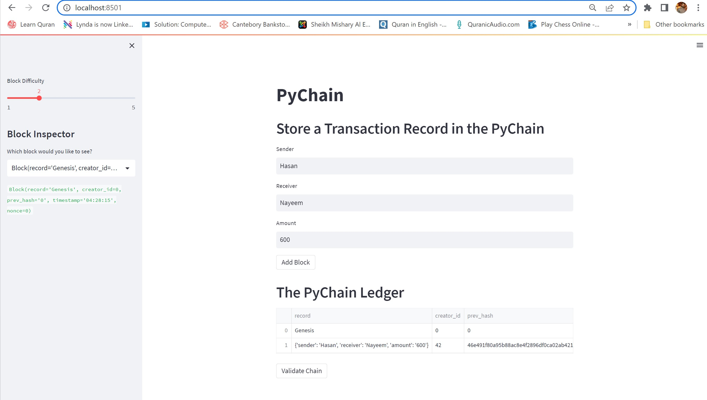

# Module---18-Challenge-Creating-Record-in-Block-Chain-and-Traking-Ledger
PyChain Calss Record sender receiver amount @dataclass Block Inputs to the Streamlit Interface
## Model Summary
- `LOGISTIC REGRESSION (BEST Performance)`: When the true label is 0, 59% of the time the machine can predict it correctly;  when the true label is 1, 92% of the time the machine can predict it correctly. Also, the AUC score is 0.94, which is a nearly perfect result.

Picture 1:  Normalised Confusion Matrix for Logistic Regression

Picture 2:  ROC Curve for Logistic Regression

 