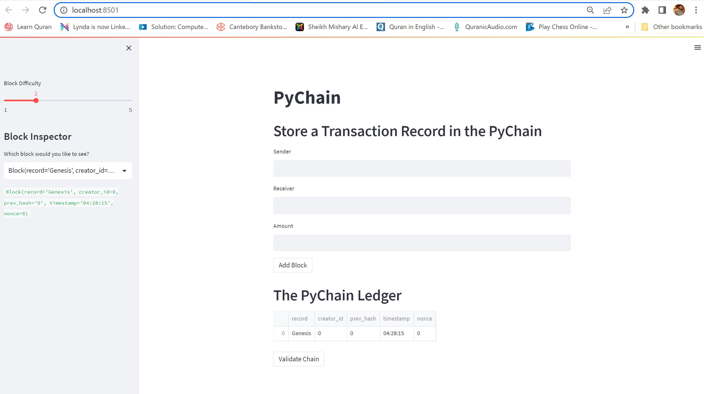

# Module---18-Challenge-Creating-Record-in-Block-Chain-and-Traking-Ledger
PyChain Calss Record sender receiver amount @dataclass Block Inputs to the Streamlit Interface
## Streamlit Application
- Running the Assignment with Steamlit the web applicaiton open the following form
Picture 1:  Store a Transaction Record in the PyChain

  

Picture 2: After submission of a Single transaction
  

 
 Picture 3: After clicking the Validate Cahin Button the return comes as true

 Picture 4: After clicking the Drop down button the Block Inspector reveals all the information added to the block earlier
